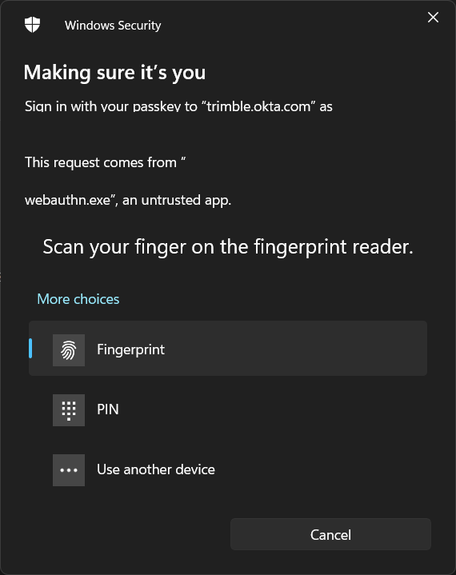

Go Webauthn client
==================

A Golang library for using (system) webauthn client APIs.

Currently only supports authentication with the Windows API.

Motivation
----------

This library allows for easy integration of host-native webauthn APIs in Golang clients.

Golang is often used for building tools requiring priveliged access to web resources.
A lot of these priveleged web resources use 2FA as a security mechanism.

One of these apps is [saml2aws](https://github.com/Versent/saml2aws). This project was originally created to allow saml2aws to use the Windows Hello
MFA when logging in through Okta, see https://github.com/Versent/saml2aws/issues/912.

Some tools integrate directly with FIDU U2F, implementing the CTAP protocol directly in the client applicvation. However, this has a couple of downsides:

- Support is often limited to specific 2nd factor authenticators (i.e Yubikeys)
- These 2nd factor authenticators are typically not built-in, making them more easily stolen.
- Some operating systems put limits on direct access to authentication devices, e.g on Windows it requires elevated priveleges.
- Direct access to devices can cause conflicts

Currently supported
-------------------

- Windows Hello WebAuthn API (authenticate only)

Currently not supported / wishlist
----------------------------------

- [MacOS Touch ID](https://developer.apple.com/documentation/localauthentication)
- Something in Linux
- [Android Fido2 API](https://developers.google.com/identity/fido/android/native-apps)


Usage
-----

### Authenticate

To authenticate a user for a registered application (Relying Party), simply call the `webauthn.Authenticate` function:

```go
import "github.com/trimble-oss/go-webauthn-client"

response, err := webauthn.Authenticate("base64-encoded-nonce", "trimble.okta.com", 3000)
```

Next, the user will typically be prompted by the system to authorise the request.

E.g on Windows 11:


